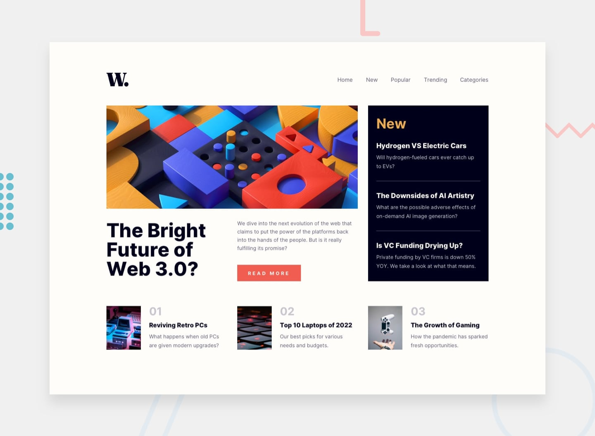

<h1 align="center"> News Homepage </h1>

 

  <a href="#-tecnologias">Tecnologias</a>&nbsp;&nbsp;&nbsp;|&nbsp;&nbsp;&nbsp;
  <a href="#-projeto">Projeto</a>&nbsp;&nbsp;&nbsp;|&nbsp;&nbsp;&nbsp;

 

  

## 🚀 Tecnologias

Esse projeto foi desenvolvido com as seguintes tecnologias:

- HTML e CSS
- JavaScript
- Git e Github

## 💻 Projeto

Projeto tirado do Front-end mentor, O News Homepage é a página inicial de um site de notícias.

- [Acesse o projeto finalizado, online](https://santana-victor.github.io/projeto-news-homepage/)